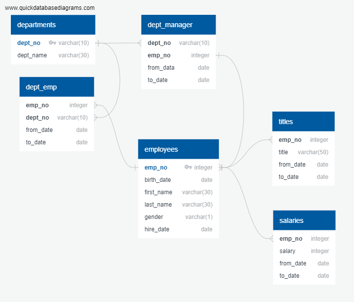

# sql-challenge

Employee Database: A Mystery in Two Parts

## Background

The task is a research project on employees of the corporation from the 1980s and 1990s. All that remain of the database of employees from that period are six CSV files.

A new database was created to perform the research by designing the tables to hold data in the CSVs, importing the CSVs into a SQL database, and answer questions about the data by writing specific SQL queries. In other words, the following were performed. 

1. Data Modeling

2. Data Engineering

3. Data Analysis

## Instructions

#### Data Modeling

Inspect the CSVs and sketch out an entity relationship diagram (ERD) of the tables utilizing [http://www.quickdatabasediagrams.com]

#### Data Engineering

* Table schema were created for each of the six CSV files. Remember to specify data types, primary keys, foreign keys, and other constraints.

* Imported each CSV file into the corresponding SQL table.

#### Data Analysis

Once the database was completed, the following queries were written for the analyis:

1. List the following details of each employee: employee number, last name, first name, gender, and salary.

2. List employees who were hired in 1986.

3. List the manager of each department with the following information: department number, department name, the manager's employee number, last name, first name, and start and end employment dates.

4. List the department of each employee with the following information: employee number, last name, first name, and department name.

5. List all employees whose first name is "Hercules" and last names begin with "B."

6. List all employees in the Sales department, including their employee number, last name, first name, and department name.

7. List all employees in the Sales and Development departments, including their employee number, last name, first name, and department name.

8. In descending order, list the frequency count of employee last names, i.e., how many employees share each last name.
